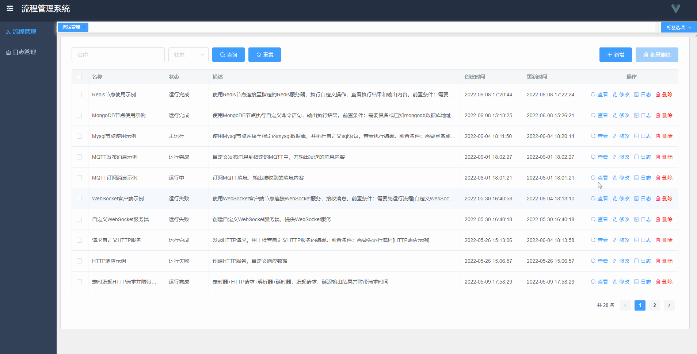
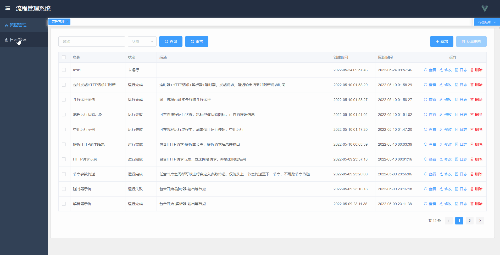

# flow-eda

### 介绍
一个由Java语言开发的基于事件驱动的流式低代码编程应用程序，您可以在编辑器中采用拖拽的形式来实现业务编程工作，一键部署，支持自定义组件和功能扩展。让开发和部署工作变得更简单高效。

欢迎各路大神共同参与开发，项目持续开发中，敬请期待...


项目名称介绍：
- flow: 流式编程
- eda: 事件驱动应用程序(Event Driven Application)


在线DEMO

作者本人自费租了云服务器，搭建了 [在线demo](http://36.138.228.74:90/#/flows)
开源不易，请珍惜服务器资源，感谢！



项目截图：







期待您的参与，项目持续开发中...

### 软件架构
软件架构说明

### 参与贡献

1.  Fork 本仓库
2.  新建 Feat_xxx 分支
3.  提交代码
4.  新建 Pull Request

### 后端技术栈

1. 部署：docker，版本20.10.14
2. 数据库：mysql，版本8.0.28
3. 微服务框架：springboot，版本2.6.4
4. 持久化框架：mybatis，版本2.2.2
5. 代码插件：lombok，版本1.18.22
6. 服务注册中心：nacos，版本2.0.4
7. 服务远程调用：dubbo，版本3.0.7
8. 数据推送：websocket，版本2.6.4
9. 消息队列：rabbitmq，版本3.9.15

### 模块说明

1. flow-eda-common 公共工具模块
2. flow-eda-runner 流运行引擎模块
3. flow-eda-web 后台管理web模块
4. flow-eda-logger 日志管理模块
5. flow-eda-vue 前端vue模块
6. flow-eda-react 前端react模块

### 支持的功能节点

1.  start节点，是触发流程执行的起始节点
2.  timer节点，定时器，定时触发流程，支持周期触发和cron表达式触发，可指定执行次数，可输出指定格式的时间戳
3.  HTTP节点，发送HTTP请求，支持herder、token等请求头，支持url带参数，支持由上游节点输入的变量
4.  output节点，输出节点，用于输出上游节点传递下来的输出参数
5.  parse节点，解析器，用于解析上游节点的输出参数，获取用户需要的参数信息
6.  delay节点，延时器，用于延迟指定时间后再执行其下游节点


### 部署

#### Docker 部署

部署mysql

```shell script
docker run --privileged=true -d -v /root/app/mysql/data/:/var/lib/mysql -v /root/app/mysql/conf.d:/etc/mysql/conf.d -v /root/app/mysql/my.cnf:/etc/mysql/my.cnf -p 3306:3306 --name mysql -e MYSQL_ROOT_PASSWORD=123456 mysql
```

部署rabbitmq

```shell script
docker run -d -p 5672:5672 -p 15672:15672 --name rabbitmq -v /root/app/rabbitmq/data:/var/lib/rabbitmq --restart=always rabbitmq
# 开启后台管理页面的插件（可选）
docker exec -it rabbitmq bash
rabbitmq-plugins enable rabbitmq_management
exit
```

部署nacos

```shell script
docker run -d -e MODE=standalone -e SPRING_DATASOURCE_PLATFORM=mysql -e MYSQL_SERVICE_HOST=10.0.4.17 -e MYSQL_SERVICE_USER=root -e MYSQL_SERVICE_PASSWORD=123456 -e MYSQL_SERVICE_DB_NAME=nacos_config -e JVM_XMS=256m -e JVM_XMX=256m -e JVM_XMN=256m -p 8848:8848 -p 9848:9848 -p 9849:9849 --privileged=true --name nacos --restart=always nacos/nacos-server
```

部署springboot应用

```shell script
# 打包镜像
sh build.sh
# 启动应用
sh start.sh
```


#### docker-compose 部署

```shell script
# 打包镜像
sh build.sh
# 创建容器，在`docker-compose.yml`文件路径下执行
docker-compose up -d
```


### TODO功能点列表

- [x] 后端全局异常封装定义和处理
- [x] 后台微服务之间通过dubbo调用接口，使用nacos作为注册中心
- [x] 保存流数据后，会完全覆盖之前的数据，并不会开始运行流
- [x] 需要在每个节点的实现类里接收到上一个节点的输入参数，并传递本节点的输出参数至下一节点
- [x] 引入websocket，推送节点运行时状态到前端，展示到界面上
- [x] 运行流程时，如果含有输出节点，则需要将输出内容通过websocket推送到前端节点信息上
- [x] 流程运行时，需要实时展示每个节点的运行状态图标：运行中/运行完成运行失败，如果失败，需要展示失败原因
- [x] 编辑器面板工具栏支持删除/复制/粘贴等编辑功能
- [x] 流程列表中去掉运行/停止按钮，仅可在流程详情页面运行
- [x] 所有节点数据在运行之前，后端需要统一进行节点数据校验，包括必填性校验和合法性校验等
- [x] 运行流程时，如果发生错误，前端需要弹出提示错误内容
- [x] 类似定时器这种多线程节点在运行完成后，需要通知流程执行线程其运行状态变更
- [x] 引入rabbitmq，用于运行流程时推送流程状态到web服务，更新数据库状态
- [x] 流程在运行时，需要实时计算流程的状态，并推送到前端，同时发送到mq队列中
- [x] 为流程设计一个运行状态，若流程中含有定时器等非一次性节点正在运行时，需要将状态展示到界面上
- [x] 需要一个流程停止运行功能，当流程处于运行中的状态时，支持用户停止运行该流程
- [x] 流程运行结束后，需要更新到数据库，并清理该流程的所有运行缓存数据
- [x] 停止流程运行后,需要正确更新流程的状态和节点实时状态推送
- [x] 流程开始运行后需要实时推送运行状态至前端，便于前端展工具栏示运行/停止按钮
- [x] 采集日志，统一管理。由于服务器内存不足，原本计划使用kafka替换为rabbitmq作为日志写入缓冲队列
- [x] 使用Aspect实现日志切面，配合rabbitmq将业务操作日志收集到日志模块进行统一处理
- [x] 日志模块采集的日志分为流程运行日志和业务操作日志分别存储为日志文件，流程运行日志根据流程id区分存储
- [x] 流编辑器工具栏新增查看日志功能，可以实时查看流程的运行日志
- [x] 新增日志管理菜单，可查看操作日志和运行日志
- [x] 流程列表新增一个查看日志功能，可以查看该流程当天的运行日志
- [ ] 使用React重新搭建一套前端框架


### 运行引擎功能点

- [x] 开始运行流后，立即开始执行一次当前流程，若流程中含有定时器等非一次性节点，则该流程会一直在后台执行直至结束
- [x] 所有节点都有一个可选的自定义输入参数payload，用于传递参数到下一节点
- [x] 节点参数需要支持${}占位符，用于解析上一个节点传递下来的参数，并在运行时应用
- [x] 运行bug：当流程中同时存在开始节点和定时器节点时，运行流程会出现并发问题
- [x] 流程运行时，实时推送每个节点的运行状态到前端，如果节点运行异常，需要推送异常信息
- [x] 需要在每个节点的实现里，添加所有参数的校验，当校验失败时，需要抛出异常，通知web服务
- [x] 定时器节点支持解析并执行用户输入的cron表达式，支持永久执行
- [x] 定时器节点支持输出指定格式的时间戳
- [x] 流程正在运行时，需要支持停止运行的功能
- [x] 流程的运行状态需要持久化，并支持实时更新和推送
- [x] 流程的运行日志异步推送到日志模块，单独处理和存储


### 发现bug及解决

- [x] 后端bug：websocket在高并发情况下，对同一session的多条消息同时推送会产生异常--加锁
- [x] 前端bug：打开多个流程的编辑页面时数据不会刷新，这是vue官方的设计，并且jsPlumb多个页面会互相影响，多次尝试后无果，暂时放弃多个编辑页
- [x] 前端bug：由于vue3和jsPlumb组件的限制，导致无法同时打开多个编辑页进行编辑流，故而修改前端设计，改为仅可打开一个编辑页面
- [x] 前端bug：编辑器面板初始化后，默认不聚焦，所有的键盘监听事件全部失效--进入页面加个自动聚焦
- [ ] 前端bug：编辑器工具栏的缩放功能使用后，再双击面板或者拖动面板内容，都会使缩放比例和位置复原



### 待优化项

- [x] 后端表的id全部用字符串，尽量避免使用自增数字id带来的安全隐患--流程id已替换为字符串
- [x] 数据库表根据业务需求建立相关索引
- [x] 运行引擎采用统一的线程池管理，避免创建线程池过多过杂导致线程难以管理难以清理缓存数据
- [x] 前端所有的API接口请求时，统一封装一个异常处理和返回值处理，封装所有API接口超时的统一弹框提醒
- [x] 前端使用React框架重新开发出一套前端代码
- [ ] 因为websocket在同一个session的高并发情况下出现问题，考虑使用EMQX替代websocket进行消息推送
- [x] 新增日志采集模块，用于采集和存储各类日志
- [ ] 新增oauth模块，用于鉴权认证，整个平台需要实现鉴权和数据隔离
- [ ] 将运行引擎中的某些特定的功能模块优化为自定义注解的形式
- [x] 编写部署脚本，采用docker自动化部署
