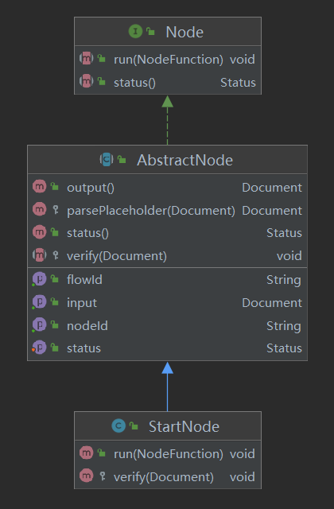

# 设计思想

本项目的主要设计思想是采用低代码可视化拖拽编程的方式来实现一些常用的业务逻辑。
用户可以通过拖拽连接一个个功能节点来组成流程图并运行，达到实现业务功能的目的。

### 项目交互流程

用户使用本项目平台的交互流程图：


通过上图可以很直观的看到用户与平台交互的整个运行过程，以及各个服务模块担任的功能职责。

- vue 和 react 为前端项目，部署后用户通过浏览器访问前端页面
- 用户访问平台首先需要登录/注册，这部分功能是由 oauth2 服务负责
- 整个平台的所有接口服务等资源均由 oauth2 服务提供鉴权认证
- 用户访问平台的所有 API 接口均由 web 服务提供，用户的流程数据存储也是由 web 服务负责
- 流程运行时，由 web 服务调用 runner 服务运行流程，由 runner 服务负责执行流程的运行
- runner 服务在运行流程时会产生运行日志，通过 rabbitmq 发送到 logger 服务，同时通过 websocket 将运行信息推送到前端
- logger 服务负责收集和存储日志信息，同时也提供了查询日志的功能

### 功能节点

功能节点是将各个单独的功能逻辑封装起来的一种逻辑单元，每个功能节点都有它自己的功能属性，例如延时器节点可以延迟流程执行、输出节点可以输出参数内容等。
关于功能节点的详细定义和使用说明请查看[功能节点](getting-started/flow-node.md)。

功能节点是组成流程图的最小基本单元，一个流程图至少含有一个功能节点。将各个功能节点进行连接组合，再填写好节点参数，一个简单的流程图就绘制完成了。

#### 节点对象设计

功能节点的对象模型在 runner 服务中定义，主要用于流程运行时执行各个节点的逻辑功能。

在项目模块`flow-eda-runner`中，功能节点全都定义在`com.flow.eda.runner.node`包下面。我们定义了一个节点接口`Node`：

```java
public interface Node {
    /**
     * 运行当前节点实例
     *
     * @param callback 回调函数，当前节点执行完毕之后进行回调
     */
    void run(NodeFunction callback);

    /**
     * 获取当前节点的执行状态
     *
     * @return 节点状态，初始值为 Status.RUNNING
     */
    Status status();

    /** 节点的运行状态定义 */
    enum Status {
        /** 运行中 */
        RUNNING,
        /** 运行完成 */
        FINISHED,
        /** 运行失败 */
        FAILED
    }
}
```

还定义了一个节点抽象类`AbstractNode`，此类是`Node`接口的子类。

```java
/** 节点抽象类 */
public abstract class AbstractNode implements Node {
    /** 输入参数，由上个节点传递至此 */
    private final Document input;
    private final String flowId;
    private final String nodeId;
    /** 节点自定义参数，可传递至下个节点 */
    private Document payload;
    /** 节点当前的运行状态 */
    private Status status = Status.RUNNING;

    /**
     * 抽象类含参构造，用于约束子类必须有一个含参构造
     *
     * @param params 节点的输入参数，由上一个节点传递至此
     */
    public AbstractNode(Document params) {
        this.flowId = params.getString("flowId");
        this.nodeId = params.getString("nodeId");
        this.payload = params.get("payload", Document.class);
        this.input = params.get("input", Document.class);
        // 校验节点参数
        this.verify(params);
    }

    /** 节点参数校验 */
    protected abstract void verify(Document params);
}
```

项目规定所有的节点对象都必须继承此节点抽象类`AbstractNode`，便于统一运行和管理。我们以任一节点为例，查看它的依赖关系图：



由上图可以看出，每个功能节点都必须含有两个方法，其中`run`方法是节点接口的运行方法的实现，供外部调用。
`verify`方法是节点抽象类的抽象方法的实现，用于校验节点的参数。除此之外，每个功能节点都必须含有一个含参构造函数，用于将参数传递至父类抽象节点。

下面是一个最简单的节点代码示例：

```java
public class StartNode extends AbstractNode {

    public StartNode(Document params) {
        super(params);
    }

    @Override
    public void run(NodeFunction function) {
        // 设置节点运行状态为完成
        setStatus(Status.FINISHED);
        // 节点运行完之后进行回调
        function.callback(output());
    }

    @Override
    protected void verify(Document params) {}
}
```

规定所有的功能节点都必须按照这个模板的格式来开发，各节点可以在`verify`方法内获取自己定义的个性化参数，在`run`方法内定义自己的运行逻辑。
这样统一规范有利于各节点的统一管理和运行，同时也便于各个节点的功能扩展和个性化开发。

### 未完待续...
