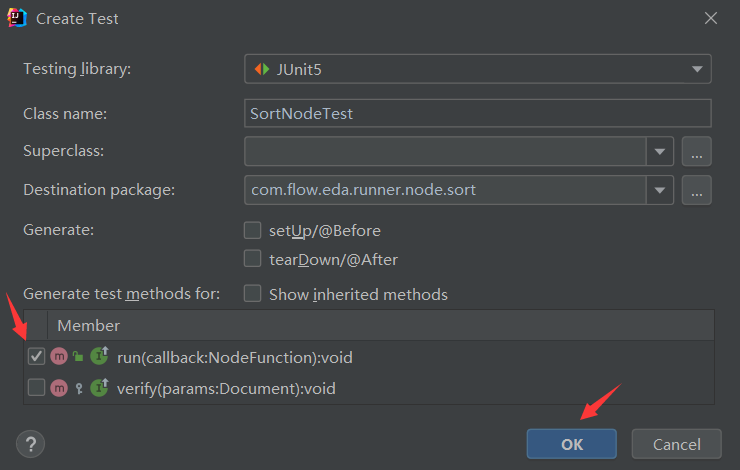

# 扩展开发

本项目后端采用了微服务、模块化、配置化的设计方式，便于二次开发和功能扩展；
前端采用了轻量化、模板化的设计方式，能够自动兼容新增的扩展功能。

在基于本项目做二次开发和功能扩展时，几乎不需要改动已有代码，仅添加新增的功能代码即可，极大的方便了扩展开发。

### 新增功能节点

当本项目已有的功能节点无法满足你的业务需求时，我们就可以新增功能节点来满足需求。
本项目针对新增功能节点预留了极大的扩展空间，您可以很灵活便捷地来扩展功能节点。

想要新增一个功能节点，首先你得明确该功能节点的需求（功能），其次，需要确定该节点的属性参数、是否必填等。

下面我们以一个简单的案例来介绍新增功能节点的整个过程，案例需求：

- 主要功能：对指定数组中的数字进行排序，支持顺序和倒序，节点名称为“排序”
- 节点参数：定义了两个节点参数，分别为：字段名（必填，用于取哪个字段的值）、排序（默认顺序）（选填，单选框，选项有顺序/倒序）

#### 新增节点类

以上述案例为例，我们需要新增一个“排序”节点，在`flow-eda-runner`项目的包`com.flow.eda.runner.node`路径下新增一个`sort`包，
在该包下新增`SortNode`类：

```java
package com.flow.eda.runner.node.sort;

import com.flow.eda.runner.node.AbstractNode;
import com.flow.eda.runner.node.NodeFunction;
import org.bson.Document;

public class SortNode extends AbstractNode {

    public SortNode(Document params) {
        super(params);
    }

    @Override
    public void run(NodeFunction callback) {

    }

    @Override
    protected void verify(Document params) {

    }
}
```

根据案例需求，该节点有两个参数，我们分别定义为`field`和`order`，然后需要在`verify`方法内对这两个节点参数作校验和取值。
校验完参数后，我们将节点的功能（排序）逻辑写在`run`方法中，排好序之后，需要进行回调，将结果输出。

我们写好之后的完整代码如下：

```java
package com.flow.eda.runner.node.sort;

import com.flow.eda.runner.node.AbstractNode;
import com.flow.eda.runner.node.NodeFunction;
import com.flow.eda.runner.node.NodeVerify;
import com.flow.eda.runner.utils.PlaceholderUtil;
import org.bson.Document;

import java.util.Arrays;
import java.util.List;

public class SortNode extends AbstractNode {
    /** 字段名 */
    private String field;
    /** 排序（默认顺序） */
    private String order;
    /** 数组（字段值） */
    private List<Integer> array;

    public SortNode(Document params) {
        super(params);
    }

    @Override
    public void run(NodeFunction callback) {
        // 对数组进行排序
        if ("倒序".equals(this.order)) {
            this.array.sort((x, y) -> Integer.compare(y, x));
        } else {
            // 默认顺序
            this.array.sort(Integer::compareTo);
        }

        // 节点运行完成
        setStatus(Status.FINISHED);

        // 调用回调函数，输出结果
        callback.callback(new Document("result", this.array));
    }

    @Override
    protected void verify(Document params) {
        // 获取字段名
        this.field = params.getString("field");
        // 校验该字段不能为空（必填项）
        NodeVerify.notNull(this.field, "field");

        // 获取排序方式（选填）
        this.order = params.getString("order");

        // 校验输入参数不能为空
        NodeVerify.isTrue(!getInput().isEmpty(), "input");
        // 从输出参数中获取指定字段值
        Document res = PlaceholderUtil.parse(getInput(), Arrays.asList(this.field));

        // 校验指定字段值类型必须为数组
        Object result = res.get(this.field);
        NodeVerify.notNull(result, "field");
        NodeVerify.isTrue(result instanceof List, "field");

        // 将数组转化为数字数组，赋值
        try {
            this.array = (List<Integer>) result;
        } catch (Exception e) {
            NodeVerify.throwWithName("field");
        }
    }
}
```

#### 新增节点单元测试

当我们开发好功能节点代码之后，需要新增对应的节点单元测试，用来测试其节点功能的正确性。

在节点类名上按编辑器的提示快捷键，为该节点类创建单元测试 Test




在节点单元测试类中给定测试数据，运行该节点，然后使用断言来判断节点运行结果是否与预期值一致。

> 注意：上一个节点的输出参数作为本节点的输入参数，我们在单元测试中需要用`input`字段来模拟。

```java
class SortNodeTest {

    @Test
    void run() {
        // 定义无序数组
        List<Integer> array = Arrays.asList(8, 3, 1, 2, 9, 4, 7, 6, 5);
        // 定义节点输入参数
        Document input = new Document("n", array);

        // 测试顺序
        Document params = new Document("field", "n").append("input", input);
        Node node = new SortNode(params);
        node.run(p -> Assertions.assertEquals(
                                p.get("result"), Arrays.asList(1, 2, 3, 4, 5, 6, 7, 8, 9)));

        // 测试倒序
        Document params1 = new Document("field", "n").append("order", "倒序").append("input", input);
        Node node1 = new SortNode(params1);
        node1.run(p -> Assertions.assertEquals(
                                p.get("result"), Arrays.asList(9, 8, 7, 6, 5, 4, 3, 2, 1)));
    }
}
```

运行该单元测试，测试通过，则表示该节点功能正常。

> 节点业务复杂的情况下，我们需要在单元测试中模拟不同场景的边界值来测试该节点在极端情况下的运行是否正常
