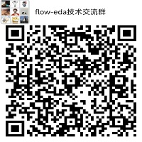

# flow-eda

### 项目简介

flow-eda 项目是一种基于事件驱动的流式低代码编程应用程序，它的主要功能是采用可视化编程，以拖拽节点、连接组合节点的形式来完成流程绘制，达到低代码开发和实现业务编程的目的。

#### 项目名称

- **flow**: 流程图、流式编程
- **eda**: 事件驱动应用程序 (Event Driven Application)
- **flow-eda**: 一种基于事件驱动的流式低代码编程应用程序

### 项目特点

- 整个流程运行引擎全都在后端实现，前端非常轻量，所有的数据、参数、包括输入框等数据全由后端配置提供，前端仅负责根据数据展示。后期开发仅扩展后端功能即可，前端无需更改，自动兼容。
- 流程运行引擎做到模块化、配置化。后期在进行功能扩展和开发时，仅需要针对新增的功能，新增配置和新增模块功能代码即可，运行引擎自动适配。
- 后端设计采用微服务架构，各个模块之间按业务功能相互解耦。便于后期二次开发和功能扩展。
- 代码风格严格按照规范执行，后端代码遵循 Alibaba 规范，代码格式使用 google-java-format 格式化，前端代码使用 Prettier 格式化，消除代码中的标黄警告等，做到编码规范化。

### 项目模块

- **flow-eda-common** 公共工具模块
- **flow-eda-runner** 流程运行引擎模块
- **flow-eda-web** 后台管理 web 模块
- **flow-eda-logger** 日志管理模块
- **flow-eda-oauth2** 认证鉴权模块
- **flow-eda-vue** 前端 vue 模块
- **flow-eda-react** 前端 react 模块

### 主要功能

- 支持用户登录和注册，接口鉴权、数据隔离
- 流程管理、日志管理。菜单简洁，便于用户使用
- 支持绘制任意的流程图，没有繁琐的条件约束，仅针对某些节点的必填参数做了校验
- 各功能节点地位平等，不分头尾，可任意连接绘制，连接数量无上限
- 支持用户自定义参数，使用占位符${}即可获取参数值，由上至下可无限传递，可在任意位置取值
- 支持在绘制流程图时使用常用快捷键对节点进行操作
- 流程图支持导入/导出功能，可以快速的导入绘好的流程并进行修改
- 可实时查看流程运行状态变化，便于用户了解流程运行至哪一步，以及各节点当前的状态、错误信息等
- 支持查看流程实时运行日志功能，可查看实时运行日志和历史运行日志，内含各个节点的输入输出参数
- 支持并发，流程采用并行运行的方式，会自动从流程中找出所有起始节点同时开始运行，数据隔离，互不干扰
- 提供了大量的流程图示例可供参考，每个功能节点都有对应的流程图示例

更多功能，等着你发现！

### 交流群

若需要技术支持或者想进行技术交流，可以扫码添加本人微信或者微信群，也可以进群提开发要求，我会尽可能进行扩展开发。欢迎加群进行技术交流！

